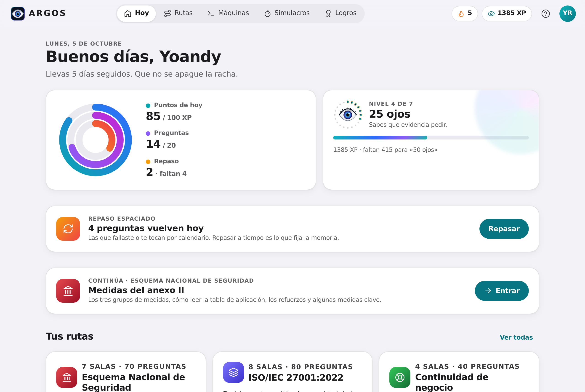
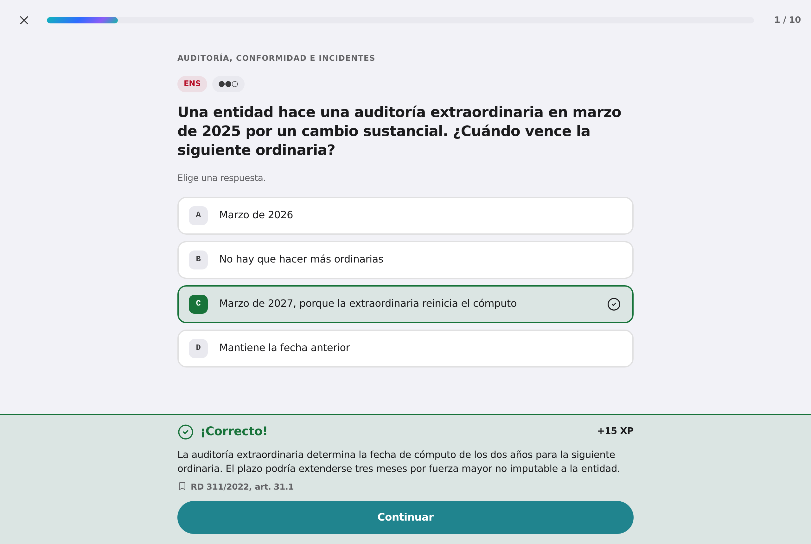
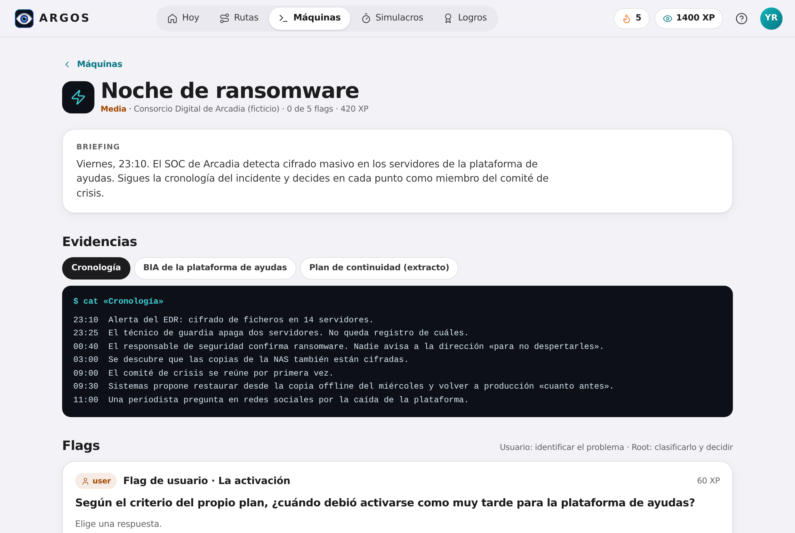
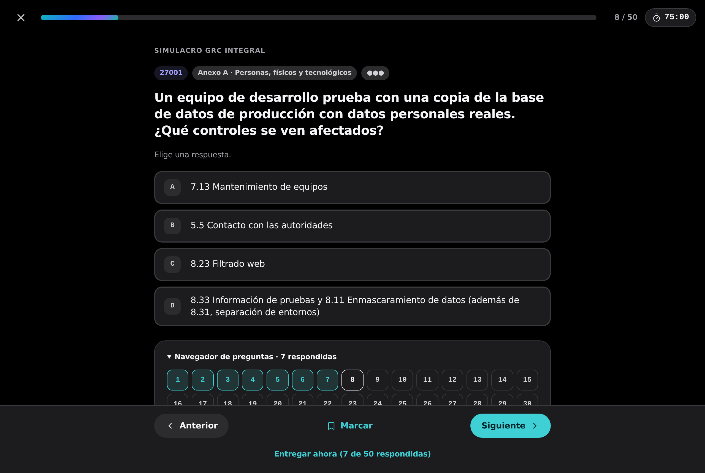
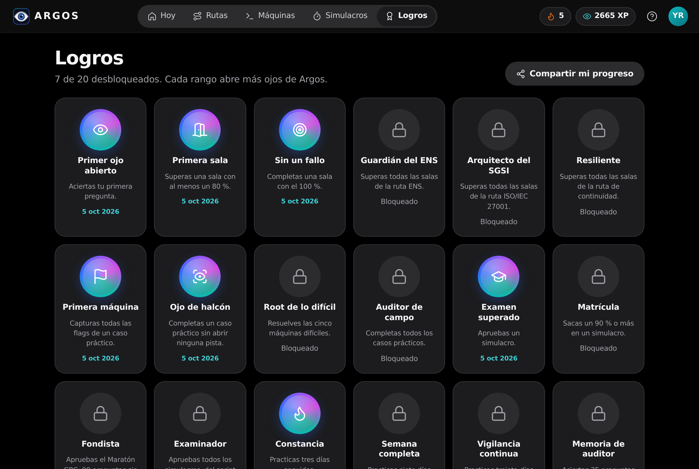
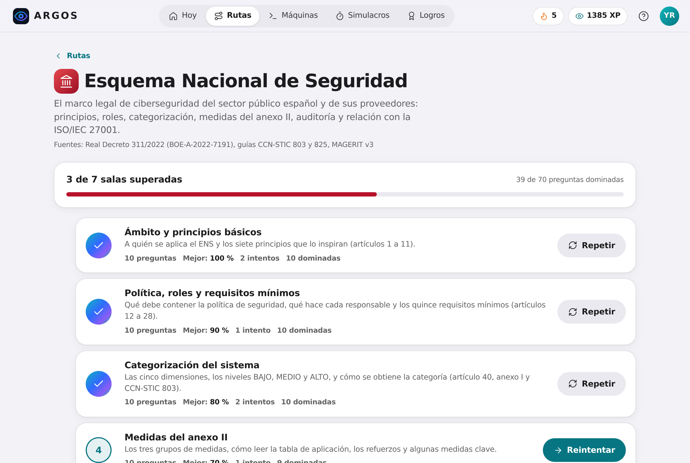
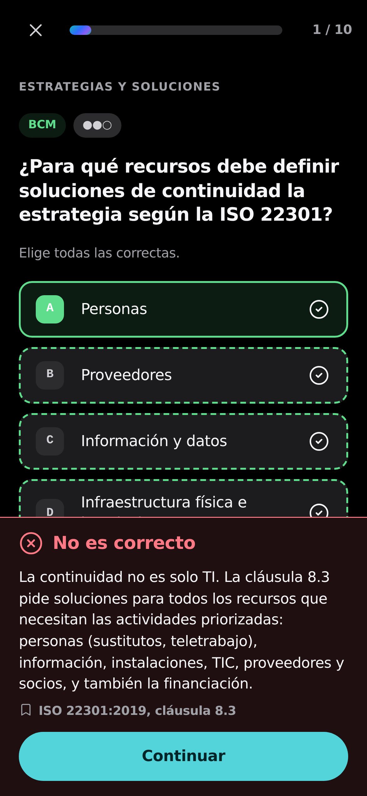

<p align="center">
  
</p>

<p align="center">
  <b>Un laboratorio para practicar GRC como se practica en Hack The Box: rutas, salas, casos prácticos con flags, simulacros cronometrados, puntos, rangos y logros. Gratis, de código abierto y sin cuentas.</b>
</p>

<p align="center">
  <a href="https://heindall92.github.io/argos-grc/"></a>
</p>

<p align="center">
  <a href="https://github.com/heindall92/argos-grc/actions/workflows/tests.yml"></a>
  <a href="LICENSE"></a>
  <a href="LICENSE-CONTENIDO.md"></a>
  
  
  
  
</p>

> [!IMPORTANT]
> **ARGOS es un proyecto independiente.** No tiene relación con ISO, IEC, PECB, el CCN ni ninguna entidad de certificación. ISO, ISO/IEC 27001 e ISO 22301 son marcas de la International Organization for Standardization. Todas las preguntas y casos son de elaboración propia: **no reproducen el texto de ninguna norma ISO ni contienen preguntas de exámenes reales**. Los logros y rangos miden tu progreso en el laboratorio y **no son una certificación**.

<p align="center">
  <picture>
    <source media="(prefers-color-scheme: dark)" srcset="docs/img/hoy-dark.png">
    
  </picture>
</p>

## Por qué existe

Prepararse para el ENS o la ISO/IEC 27001 es estudiar decenas de documentos sueltos: el real decreto, las guías CCN-STIC, apuntes, diapositivas, PDF de cursos. Hay mucho material, pero casi nada para **practicar**: preguntas con su explicación, casos reales que analizar y un examen de prueba con reloj. Lo poco que hay es de pago o de procedencia dudosa.

Además, desde el 1 de abril de 2025 el CCN solo emite certificados en los cursos con formación reglada. Quien estudia el ENS por su cuenta no tiene nada que marque su avance.

**ARGOS lo convierte en un juego que engancha**, con la mecánica que ya funciona en la comunidad de ciberseguridad:

| | |
|---|---|
| **Rutas y salas** | 3 rutas (ENS, ISO/IEC 27001 y continuidad de negocio), 19 salas y 190 preguntas. Cada respuesta se explica al momento y cita su fuente exacta. En el ENS, con el texto literal del BOE. |
| **Máquinas** | 15 casos prácticos al estilo de un CTF (5 fáciles, 5 medias y 5 difíciles), con 75 flags. Analizas evidencias (documentos, registros, tablas) de empresas ficticias y capturas flags de usuario (identificar el problema) y de root (clasificarlo y decidir). |
| **Simulacros** | 3 exámenes cronometrados con preguntas al azar de todas las salas. Se corrigen al entregar, con el desglose por sala y la revisión de cada fallo. |
| **Repaso espaciado** | Cada pregunta entra en un sistema de cajas de Leitner. Lo que fallas vuelve hoy y lo que aciertas, en 1, 3, 7, 14 y 30 días. |
| **Puntos, rangos y logros** | 7 rangos, del «Primer ojo» a «Panoptes» (los cien ojos abiertos), 17 logros, racha diaria y anillos de actividad al estilo Apple. |
| **Tarjeta para LinkedIn** | Genera una imagen con tu rango y tu progreso, más el texto para publicarla. |

### ¿Por qué Argos?

Argos Panoptes, el gigante de la mitología griega, tenía cien ojos y nunca los cerraba todos a la vez: mientras unos dormían, otros vigilaban. Nada se le escapaba.

Eso es lo que se espera de quien audita un sistema de gestión.

En ARGOS empiezas con un solo ojo abierto. Cada sala que superas, cada flag que capturas y cada simulacro que apruebas abren otro. Con los cien abiertos llegas a **Panoptes**: el que lo ve todo.

## Capturas

<table>
  <tr>
    <td width="50%"></td>
    <td width="50%"></td>
  </tr>
  <tr>
    <td></td>
    <td></td>
  </tr>
  <tr>
    <td></td>
    <td align="center"></td>
  </tr>
</table>

## El contenido

| Ruta | Salas | Fuente |
|---|---|---|
| **Esquema Nacional de Seguridad** | Ámbito y principios · Política, roles y requisitos mínimos · Categorización · Medidas del anexo II · Auditoría, conformidad e incidentes · Análisis de riesgos con MAGERIT · Puente ENS ↔ ISO/IEC 27001 | RD 311/2022 (BOE-A-2022-7191), con 23 citas literales comprobadas automáticamente contra el texto del BOE. Guías públicas CCN-STIC 803 y 825, y MAGERIT v3. |
| **ISO/IEC 27001:2022** | Fundamentos y estructura · Contexto y liderazgo · Riesgos y SoA · Apoyo y operación · Evaluación y mejora · Anexo A organizacional · Anexo A personas, físicos y tecnológicos · Certificación y auditoría | Redacción propia que cita la cláusula o el control (también ISO/IEC 27002, 17021-1, 27006-1 e ISO 19011). |
| **Continuidad de negocio** | Conceptos y BIA · Estrategias y soluciones · Planes, crisis y comunicación · Pruebas y mejora | Redacción propia con referencia a ISO 22301:2019, a los controles 5.29, 5.30, 8.13 y 8.14, y a las medidas op.cont del ENS. |

| Máquina | Dificultad | De qué va |
|---|---|---|
| Copias de Hespéride | Fácil | Normativa de copias que no cumple mp.info.6 y un correo de «OK» que no prueba nada. |
| El exempleado | Fácil | Un exanalista entra por VPN dos semanas después de irse. Retirada de accesos, doble factor y notificaciones. |
| El correo del director | Fácil | Phishing a toda la plantilla: señales, notificación de eventos, contención y concienciación. |
| Puesto despejado | Fácil | Ronda por la oficina: pantallas sin bloquear, una contraseña de administración en un pósit y un visitante sin identificar. |
| El contrato de nube | Fácil | Revisar un contrato de nube: requisitos ENS en el pliego, alcance del certificado, POC de seguridad y ubicación de los datos. |
| La categoría de Arcadia | Media | Valorar información y servicios, determinar la categoría y detectar quién no puede decidir qué. |
| Noche de ransomware | Media | Cronología de una crisis: activación del plan, RPO, evidencias forenses, reconexión y comunicación. |
| La SoA sospechosa | Media | Exclusiones que el ENS no permite, una medida compensatoria verbal y la firma equivocada. |
| Viernes de despliegue | Media | Un cambio en producción sin aprobar tumba el campus antes de un examen: cambios, segregación y entornos. |
| El BIA de Pegaso | Media | Cruzar el BIA con las capacidades reales: dependencias, RTO, RPO, MTPD y proveedores. |
| Auditoría de certificación | Difícil | Etapa 2 de una certificación: clasificar no conformidades y decidir si se recomienda certificar. |
| Riesgo en euros | Difícil | Análisis cuantitativo con MAGERIT: impacto, riesgo anual, salvaguardas, riesgo residual y criterio de aceptación. |
| La auditoría interna | Difícil | Auditar la auditoría: programa, imparcialidad, hallazgos sin evidencia y acciones correctivas sin verificar. |
| Caída del proveedor crítico | Difícil | La región de nube cae sin fecha: activar a tiempo, un respaldo inseguro y decidir con riesgo asumido. |
| Certificación ENS de Arcadia | Difícil | Categoría ALTA: auditoría extraordinaria olvidada, plazos vencidos, el «atajo ISO» y el circuito del informe. |

Las empresas son ficticias: Hespéride Servicios Digitales, el Consorcio Digital de Arcadia y el Instituto Pegaso de Formación.

## Uso

**En línea:** [heindall92.github.io/argos-grc](https://heindall92.github.io/argos-grc/).

**Sin conexión:** descarga [`dist/index.html`](dist/index.html) y ábrelo en el navegador. Es un único fichero de unos 280 KB, sin dependencias.

Tu progreso se guarda solo en ese navegador. En *Perfil → Tus datos* puedes exportarlo a un JSON e importarlo en otro equipo.

| Atajo | Acción |
|---|---|
| <kbd>1</kbd>–<kbd>5</kbd> | Elegir una opción |
| <kbd>V</kbd> / <kbd>F</kbd> | Verdadero o falso |
| <kbd>Intro</kbd> | Comprobar y continuar |
| <kbd>←</kbd> <kbd>→</kbd> | Pregunta anterior y siguiente en los simulacros |
| <kbd>Esc</kbd> | Salir de la sala o cerrar un diálogo |
| <kbd>G</kbd> luego <kbd>H</kbd> <kbd>R</kbd> <kbd>M</kbd> <kbd>S</kbd> <kbd>L</kbd> | Ir a Hoy, Rutas, Máquinas, Simulacros o Logros |

## Desarrollo

```bash
git clone https://github.com/heindall92/argos-grc && cd argos-grc
node app/build.js                 # valida el banco y construye dist/index.html
python3 -m venv .venv && source .venv/bin/activate
pip install -r requirements.txt && python -m playwright install chromium
./run_tests.sh                    # construcción, motor, banco, navegador y accesibilidad
```

```
app/
  build.js           construcción: valida el banco, concatena y genera la CSP por hashes
  data/              banco de preguntas: ens.js, iso27001.js, continuidad.js, maquinas.js, simulacros.js
  src/engine.js      motor sin DOM: corrección, XP, rangos, Leitner, rachas, simulacros, logros y validación
  src/ui/            interfaz en JavaScript sin dependencias (núcleo, iconos, estructura, vistas, jugador, eventos)
  src/styles.css     sistema de diseño: tipografía del sistema, colores semánticos, claro y oscuro
dist/index.html      la app completa en un fichero autónomo
tests/               node:test (motor y banco), Playwright (extremo a extremo) y axe-core (accesibilidad)
```

## Calidad

| Prueba | Comprobaciones | Qué cubre |
|---|---|---|
| Motor (`tests/engine.test.js`) | 13 | Corrección de los tres tipos de pregunta, XP, rangos, fechas, cajas de Leitner, rachas, barajado sin sesgo, simulacros, logros y validación. |
| Banco (`tests/banco.test.js`) | 12 | Integridad del banco, variedad de tipos y dificultades, pistas, fuentes, **citas literales comprobadas contra el BOE** y ausencia de texto de normas ISO o de promesas de certificación. |
| Extremo a extremo (`tests/e2e_app.py`) | 96 | Recorre la app en Chromium: salas, repaso, simulacros y tiempo agotado, máquinas con pistas, perfil, tarjeta PNG, exportación e importación de JSON hostil, almacenamiento manipulado, CSP, inyección, atajos y móvil sin desbordes. |
| Accesibilidad (`tests/a11y_app.py`) | axe-core | WCAG 2.2 A/AA en todas las vistas y estados (también el jugador, los diálogos y los resultados), en claro y oscuro, a 1440 y 390 px. **0 infracciones.** |

La construcción falla si el banco tiene un solo error: ids repetidos, respuestas fuera de rango, explicaciones vacías o simulacros que piden más preguntas de las que hay.

## Seguridad y privacidad

Es un único HTML con **CSP por hashes** y sin peticiones de red (`default-src 'none'`, `connect-src 'none'`). No hay cuentas, servidor ni analítica. Lo que se importa (JSON o almacenamiento local) se trata como hostil: se eliminan las claves `__proto__`, se acotan los valores, se descartan los ids desconocidos y los logros que el progreso no justifica. Detalle en [SECURITY.md](SECURITY.md).

## Contribuir

¿Has encontrado una respuesta discutible o quieres añadir preguntas? Lee [CONTRIBUTING.md](CONTRIBUTING.md): el formato es sencillo, y las pruebas validan cada pregunta antes de aceptarla. La regla de oro: **redacción propia, con la fuente citada y nunca preguntas de exámenes reales**.

## Herramientas GRC del autor

| Herramienta | Para qué |
|---|---|
| **ARGOS** | Entrenar: rutas, casos prácticos y simulacros. |
| [**Rosetta**](https://github.com/heindall92/rosetta_multinorma) | Traducir entre marcos: ENS, ISO/IEC 27001, NIS2 e ISO/IEC 42001 en 115 controles unificados, alineado con la CCN-STIC 825. |
| [**ENS Compliance Studio**](https://github.com/heindall92/grc_ens_compliance_studio) | Preparar la conformidad con el ENS: categorización, MAGERIT, Declaración de Aplicabilidad y preauditoría. |
| [**KAIROS**](https://github.com/heindall92/kairos) | Continuidad de negocio: BIA, BCP y DRP con la ruta crítica de recuperación. |

## Autor

**Yoandy Ramírez Delgado** · Junior Pentester · eJPTv2 · AI Governance (ISO 42001) · SysAdmin

<a href="https://www.linkedin.com/in/yoandyrd92/"></a>
<a href="https://github.com/heindall92"></a>
<a href="https://yoandyramirez.com"></a>
<a href="https://profile.hackthebox.com/profile/019c5812-b4ca-7315-b12f-14db6d2b42fa"></a>

## Licencia

- **Código:** [GPLv2](LICENSE).
- **Preguntas, casos prácticos y textos propios:** [CC BY-SA 4.0](LICENSE-CONTENIDO.md).
- **Citas del RD 311/2022:** proceden del BOE. Los textos legales no están sujetos a derechos de autor (artículo 13 de la Ley de Propiedad Intelectual).
- **Iconos:** Lucide (ISC).

<p align="center"></p>
